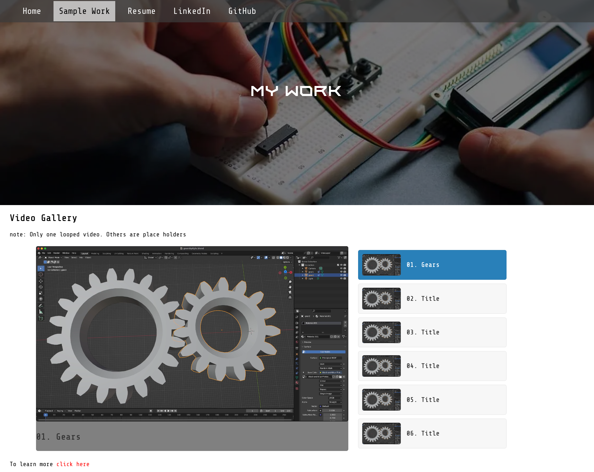

  
  

    

      
      
    

    

    
Main Repos

    

      
       
    

  

  

  <h1 align="center">hey there </h1>

### :man_technologist: About Me :

I’m Kyle, I am a Jr. Software Developer.
- :school: Have an associate degree in CIT with a focus on Software Development
- :scroll: Working on Certificate in Python from eCornell
- :scroll: Working on Certificate in Software Enginering Backend Development from Kenzie Academy
- <a href="your-gmail-link?">:mailbox:</a> How to reach me 

---

### :hammer_and_wrench: Tools :

<h3 align="center">Version Control</h3>

  

 

<h3 align="center">Languages</h3>

  

    &nbsp;
    &nbsp;
    &nbsp;
    &nbsp;
    &nbsp;
  

  
  

    &nbsp;
    &nbsp;
    &nbsp;
    &nbsp;
  

 

<h3 align="center">Server Managment</h3>

  

    &nbsp;
  

  

    &nbsp;
    &nbsp;
    &nbsp;
    &nbsp;
    &nbsp;
  

---
### :globe_with_meridians: My Website

My Website

  
  

    

      &nbsp;
    

    

      
    

  

---

### :fire: My Stats :

  
  

  

