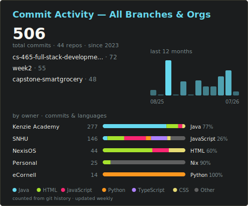

  

 
<!-- Centered badges -->

  <h3>Sample Work</h3>
  

<!-- Repositories dropdown -->

    

      
      
      
      
      
    

  

### :man_technologist: About Me :

I’m Kyle, I am a Jr. Software Developer.
#### :school: Education
- :scroll: Associate degree in Computer Information Technology(CIT) from Middlesex Community College
- :scroll: Certificate in Python from eCornell
- :scroll: Certificate in Software Enginering Backend Development from Kenzie Academy
- :scroll: Pursuing a Bachelor's degree in Computer Science from SNHU
- :mailbox: How to reach me kyle.gortych.dev@gmail.com

---

### :hammer_and_wrench: Tools :

<h3 align="center"><a href="https://github.com/KyleGortych-Kenzie-Academy-Group-Work/capstone-smartgrocery">Kenzie Academy</a></h3>

Group capstone "SmartGrocery" a multi-module Gradle Java application deployed as an AWS Lambda microservice with DynamoDB persistence, CloudFormation infrastructure-as-code, and an automated CI/CD pipeline.

  
| Cloud Service | Build System | Languages | Framework |
| ------------- | ------------ | --------- | --------- |
|  |  |  |  |

| Dependency Injection | Mocking | Caching | Database | Virtulization |
| -------------------- | ------- | ------- | -------- | ------------- |
|  |  |  |  |  |

 

<h3 align="center"><a href="https://github.com/KyleGortych-SNHU/cs-465-full-stack-development-i/tree/module7">MEAN Stack</a></h3>

Full stack travel application, server-rendered Express/Handlebars frontend, Angular SPA admin interface, and a secured RESTful API.

| Database | Backend | Frontend | Runtime |
| -------- | ------- | -------- | ------- |
|  |  |  |  |

| Authentication | Templating | Testing | CI/CD | Virtualization |
| -------------- | ---------- | ------- | ----- | ------------- |
|  |  |  |  |  |

<h3 align="center">Misc.</h3>

    &nbsp;
    &nbsp;
    &nbsp;
  

  
  

    &nbsp;
    &nbsp;
    &nbsp;
    &nbsp;
  

  

    
    
    
    
    
  

 

---

### :fire: My Stats :

